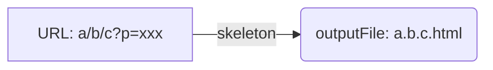
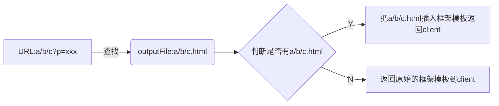

## part1:生成骨架屏

##### 一、预设一些样式class,用于给html添加骨架屏对应的class

* debug模式，在当前页面添加Button按钮 点击button触发生成骨架屏
* 移除带skeleton的class的元素，避免干扰
* 创建style标签放一些预设class样式进去
   * 文本-test-class
       * 背景中心的是content-box
       * clip剪切中心点是content-box
       * 背景色透明
       * 颜色透明  文本内的文字就隐藏了
   * 伪类class before after
       * 背景色浅灰色
       * 边框浅灰色
       * 背景图清除
   * 按钮class button
       * 清除box-shadow
       * 透明class transparent 伪元素
       * 透明度为0

##### 二、提前处理一些dom节点，增删改一些dom class
* 通过getBoundingClientRect移除不在视窗内的dom节点
* 如果标签名是STYLE直接返回，不处理
* 没有标签名直接返回
* 宽度小于预设的最小宽度，直接隐藏dom
* 获取dom的计算样式，背景图设置为none,背景色设置为骨架屏主色调
    * boxShadow清除
    * border颜色设置为骨架屏主色调
    * 给指定的节点添加背景色
* 判断是不是有伪类
    * 有伪类就添加一个伪类预处理的class
##### 三、获取各种dom标签然后处理
  * script标签
      * 直接移除
  * img
      * 获取计算属性的宽高，然后把src设置为一像素的base64 替换原来的图片
      * 背景色设置为eeeeee
  * svg
      * 如果是没有宽高或者有隐藏属性直接移除节点
      * 如果有内容清除innerHtml
      * 获取svg宽高，根据document节点fontSize的px 然后把svg的px转为rem
  * 输入框input
      * 删除placeholder属性
      * value值置为空
  * button按钮
      * 添加button class类
      * 设置button的各种样式为骨架屏样式
  * UL OL DL list列表
      * 没有list直接返回
      * 只要li dt dd 如果没有则返回
      * 如果节点的第一个不是li dt dd 则递归调用 直到找到第一个li dt dd
      * 只保留ul的第一个节点，其它的删除
      * 在ul ol dl中插入第一个li的节点以及这个li的子节点，插入个数为node的children长度
     * 这样所有的ul下面都是同样的li
  * a标签
      * 移除href
##### 四、非以上几种标签的 单独处理
* 如果class中有btn 默认为btn按钮的处理方法
* 其它节点都视为文本节点的处理handleText(node) 
    * 先把tagName大写
    * 如果有node.childNodes 并且长度是1 并且nodeType = 3为，文本 
        * 调用handle.text文本处理逻辑
        * 返回true，不再调用handeText(node)
     * 如果不是数组并且是文本并且有内容
         * 清除文本的回车换行，获取文本内容
         * 创建i标签，添加SKELETON_TEXT_CLASS公共类
         * 用i标签替换原来的node
         * 执行handle.text(i-node)
         * 返回true，不再调用handeText(node)
     * 如果是SPAN并且有innerHTML
         * 先按照handleImages的逻辑处理一遍
         * 再按照文本逻辑处理一遍
         * 返回true，不再调用handeText(node)
     * 其他情况，返回false,继续递归调用handeText(node)
* 不是btn并且文本节点返回的结果是没处理到最深层节点
    * 调用handleNodes(node.childNodes)
    * handleNodes通过forEach(node)遍历调用handleNode(node)

#### 五、text节点、空节点处理
  * text文本节点 
      * 文本宽度小于预设的最小块宽度时直接设置为0透明度，即隐藏
      * 文本可能是按钮的走按钮的逻辑
      * 常规文本处理
          * 获取各种样式
          * 如果没有行高，默认行高为字号 * 1.4 倍
          * 定位只处理fixed absolute flex 默认relative，忽略static inhert
          * 通过offsetHeight和height paddingTB计算有几行
          * 添加class SKELETON_TEXT_CLASS标记是文本类
          * 添加背景图设置liner-gradient骨架屏渐变色
          * 如果没有定位，把定位设置为relative
          * 行数大于1添加白色的蒙版
          * 行数小于为1获取文本宽度然后设置backgroundSize
          * 设置backgroundPosition根据文本的textAlign

  * 空节点
      * 先清空innerHTML
      * 既没有class又没有id直接返回
      * 找到没有href的节点，插入伪类和样式背景色置为none
  * 新建style标签插入样式
      * 全局文本类以及文本类自雷的背景样式
      * 全局伪类before after样式 设置为透明度0
      * 全局按钮样式 去掉阴影
      * 全局透明样式

  * 伪类
      * 宽度小于最小预设的最小宽度添加透明class不显示伪类
      * 宽度比较大时，添加伪类样式
  * before预处理一些样式

##### 六、最终生成四个文件，可根据需要使用
- base64的图片
- png图片
- html文件，本质上还是取的png图片的url


## part2:工程化构建

##### 一、骨架屏自动生成基本逻辑
- 发布上线后，首个访问页面的用户，根据url生成骨架屏，并存到对应的文件中。第二个和以后访问页面的用户不需要再次生成


- 根据浏览器路由查找骨架屏html所在的文件，并在后端插入到html中，返回前端


##### 二、具体实现核心代码
1. 生成逻辑在骨架屏生成代码中
2. 注入逻辑是一个express中间件，代码如下
```
const fs = require('fs');
const path = require('path');
const skeletonConfig = require('../../../skeleton.config.json'); // 骨架屏配置项
const genFinal = require('../../../awesome-skeleton/src/gen'); // 骨架屏入口

/**
 * 判断url是否有某个参数
 * @param url
 * @param string
 * @returns {boolean}
 */
const hasQuery = (url, string) => {
  return url.indexOf(string) > 0;
};

/**
 * url转为文件名称：以m.productForMixin.list.html命名的html文件
 * /m/productForMixin/list?userId=1173783329200144789 => m.productForMixin.list
 * @param url
 * @returns {string}
 *
 */
const formatSlashToDot = (url) => {
  return url
    .split('/')
    .slice(-3)
    .join('.');
};

// 这是个express中间件
export default function (app) {
  app.use(async (req, res, next) => {
    const { url, headers } = req;

    // 如果url中有标记skeleton字段，表示是第二次打开链接，不再执行生成骨架屏逻辑
    if (hasQuery(url, 'skeleton')) {
      next();
      return;
    }
    let pagePath = null;

    // 根据是否有？处理参数
    if (hasQuery(url, '?')) {
      pagePath = formatSlashToDot(url.slice(0, url.indexOf('?')));
    } else {
      pagePath = formatSlashToDot(url);
    }

    const outputFile = skeletonConfig.outputFile || 'skeleton-output';
    const folder = path.join(process.cwd(), outputFile);
    try {
      // 判断是否已生成了骨架屏html
      await fs.readFile(`${folder}/${pagePath}.html`, 'utf-8', (err, data) => {
        // 已生成，读取骨架屏代码dom，塞入模板的html中
        if (!err) {
          res.locals.html = data;
        } else if (!hasQuery(url, 'null')) {
          // 还没有生成骨架屏，去生成，先处理url
          let pageUrl = `${headers.host}${url}`;
          if (!hasQuery(pageUrl, 'http')) {
            pageUrl = `http://${pageUrl}`;
          }
          // url标记skeleton参数
          pageUrl = hasQuery(pageUrl, '?')
            ? `${pageUrl}&skeleton=skeleton`
            : `${pageUrl}?skeleton=skeleton`;

          // 执行核心的生成逻辑
          skeletonConfig.pageUrl = pageUrl;
          genFinal(skeletonConfig);
        }
        next();
      });
    } catch (e) {
      next();
    }
  });
}

```


##### 七、存在的问题
- 单页应用时，web server无法检测前端路由切换时url变化
- 针对动态生成dom,如果第一个用户的页面某个模块没有数据，生成的骨架屏也会缺失对应的模块骨架
- 针对react，react脚本加载完成后，会清除`<div id="app">skeleton</div>`内部的骨架屏内容。但是这个时候可能还在加载ajax请求，真实的dom页面还没生成，网络不好的情况下会有500ms左右的白屏时间，用户体验会变差
